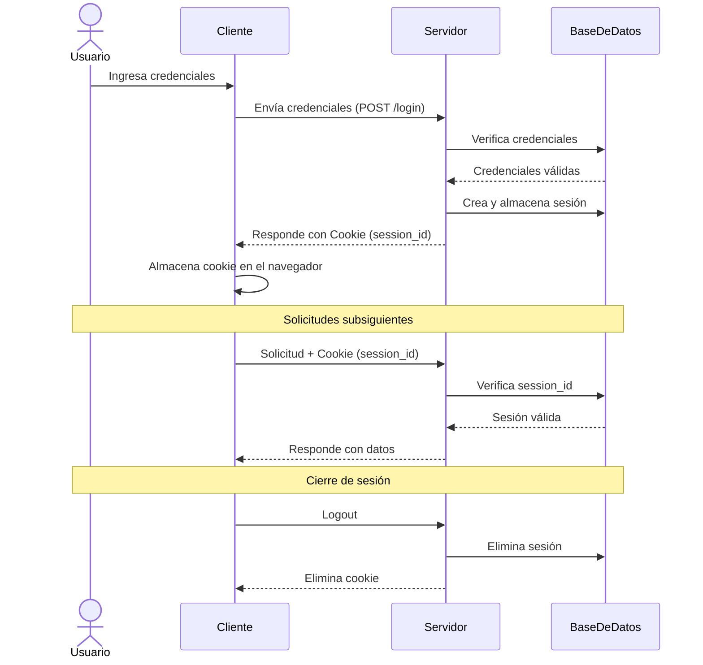
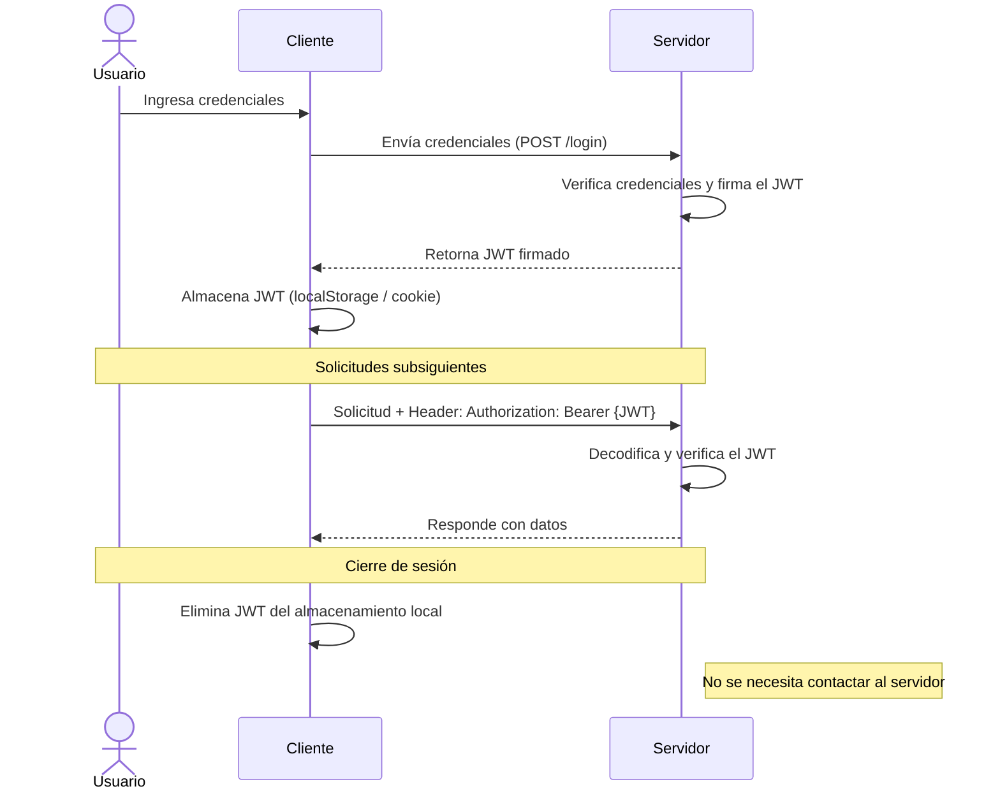

# Autenticación Stateless vs Stateful

Durante mucho tiempo, la autenticación fue **stateful**: el usuario ingresaba sus credenciales, el servidor creaba un ID de sesión y lo almacenaba del lado del servidor. Todos los datos del usuario se guardaban en el servidor, y cualquier servicio que necesitara esos datos debía consultar primero el almacén. Esto era aceptable porque al centralizar la información, era menos probable que los datos se corrompieran. Sin embargo, generó problemas en arquitecturas complejas, ya que consultar el almacén en cada operación resultaba costoso. De ahí surgió la idea de la autenticación **Stateless**.

---

## Autenticación Basada en Cookies/Sesión (Stateful)

La autenticación basada en cookies ha sido el método predeterminado y probado para manejar la autenticación de usuarios por mucho tiempo. Es **stateful**, lo que significa que se debe mantener un registro de autenticación o sesión tanto en el servidor como en el cliente. El servidor necesita rastrear las sesiones activas en una base de datos, mientras que en el frontend se crea una cookie que contiene el identificador de sesión.

### Flujo de autenticación con Cookies

**Pasos:**
1. El usuario ingresa sus credenciales de inicio de sesión.
2. El servidor verifica que las credenciales sean correctas y crea una sesión que luego almacena en una base de datos.
3. Se coloca una cookie con el ID de sesión en el navegador del usuario.
4. En solicitudes posteriores, el ID de sesión se verifica contra la base de datos y, si es válido, se procesa la solicitud.
5. Una vez que el usuario cierra sesión, la sesión se destruye tanto en el cliente como en el servidor.

---

## Autenticación Basada en Tokens (Stateless)

La autenticación basada en tokens es **stateless**. El servidor no lleva registro de qué usuarios están conectados ni qué JWTs han sido emitidos. En cambio, cada solicitud al servidor va acompañada de un token que el servidor usa para verificar la autenticidad. El token generalmente se envía como un encabezado `Authorization` adicional en la forma `Bearer {JWT}`, aunque también puede enviarse en el cuerpo de una solicitud POST o como parámetro de consulta.

### Flujo de autenticación con JWT (Token)

**Pasos:**
1. El usuario ingresa sus credenciales de inicio de sesión.
2. El servidor verifica que las credenciales sean correctas y devuelve un token firmado.
3. El token se almacena del lado del cliente, comúnmente en `localStorage`, aunque también puede almacenarse en `sessionStorage` o en una cookie.
4. Las solicitudes posteriores al servidor incluyen este token como un encabezado `Authorization` adicional.
5. El servidor decodifica el JWT y, si el token es válido, procesa la solicitud.
6. Una vez que el usuario cierra sesión, el token se destruye del lado del cliente; no se necesita interacción con el servidor.

---

## Ventajas del enfoque Stateless

- **Menor uso de memoria:** Imagina si Google almacenara información de sesión de cada uno de sus usuarios.
- **Facilita el uso de granjas de servidores:** Si necesitas datos de sesión con más de un servidor, debes sincronizarlos, normalmente mediante una base de datos. Con tokens esto no es necesario.
- **Reduce problemas de expiración de sesión:** Las sesiones que expiran pueden causar errores difíciles de encontrar y reproducir. Las aplicaciones sin sesión no sufren de esto.
- **Enlazabilidad de URLs:** Algunos sitios almacenan el ID de lo que el usuario está viendo en la sesión, lo que impide compartir URLs directamente. Con tokens esto no ocurre.

## Desventajas del enfoque Stateless

- **Clave secreta comprometida:** Lo mejor y lo peor del JWT es que depende de una sola clave. Si un desarrollador o administrador descuidado o malintencionado la filtra, ¡todo el sistema queda comprometido!
- **No se puede gestionar al cliente desde el servidor:** No es posible forzar el cierre de sesión de un usuario de forma remota (por ejemplo, si le roban el móvil).
- **No se pueden enviar mensajes a los clientes:** Al no haber registro de clientes conectados en la base de datos, no es posible hacer push de mensajes a todos ellos.
- **Los algoritmos criptográficos pueden quedar obsoletos:** El JWT depende completamente del algoritmo de firma, y en el pasado varios algoritmos han sido deprecados.
- **Sobrecarga de datos:** El tamaño del token JWT es mayor que el de un token de sesión normal. Cuantos más datos se añadan, más grande se vuelve linealmente.
- **Mayor complejidad de comprensión:** El JWT usa algoritmos criptográficos de firma para verificar los datos. Si el desarrollador no los entiende bien, puede introducir vulnerabilidades de seguridad.
